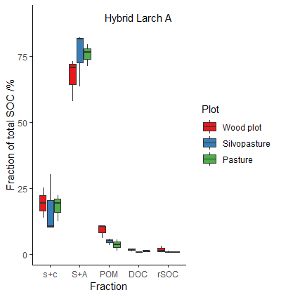
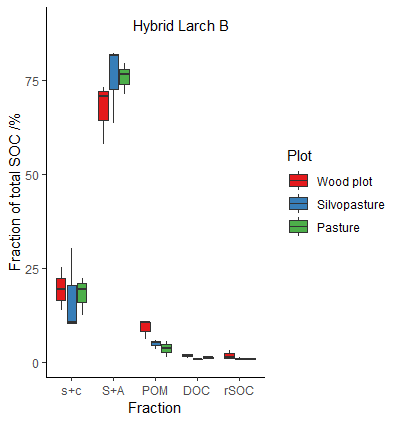

## Fractionation for model validation

    
Zimmermann M, Leifeld J, Schmidt MWI, Smith P, Fuhrer J (2007)  Measured soil organic matter fractions can be related to pools in the RothC model. European Journal of Soil Science, 58, 658-667

--- 

## Fractionation for model validation

---

--- &slidebg bg:url('heath.png')

---

--- &twocol

## Peaty soils

*** =left
* ECOSSE
    * derived from RothC (carbon) and sundial (nitrogen)
    models
    * developed for mineral and organic soils  

*** =right

    
Marschner B, Brodowski S, Dreves A et al. (2008) How relevant is recalcitrance for the stabilization of organic matter in soils? Journal of Plant Nutrition and Soil Science, 171, 91-110

--- &twocol
## Hot water extractions and acid hydrolysis

*** =left

    
Shirato Y, Yokozawa M (2006) Acid hydrolysis  to partition plant material into decomposable and resistant fractions for use in the Rothamsted carbon model. Soil Biology and Biochemistry, 38, 812-816

*** =right

--- 

## Reverse estimation of carbon pools
 

---

## Reverse estimation of carbon pools

---&slidebg bg:url('fire.png')

--- 

## Spectroscopy
# for char and carbon quality assessment

