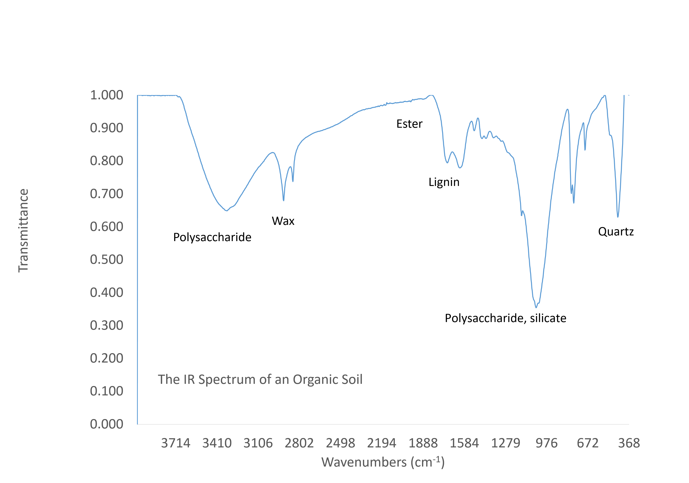

## Fractionation for model validation

---

## Fractionation for model validation
# Results

---

## Fractionation for model validation
# Results

---

---

---

--- &twocol

## Peaty soils

*** =left
* ECOSSE

*** =right

---
## Hot water extractions and acid hydrolysis

--- 

## Reverse estimation of carbon pools
 

--- 

## Spectroscopy
# for char and carbon quality assessment

--- 

## Conclusion

---
