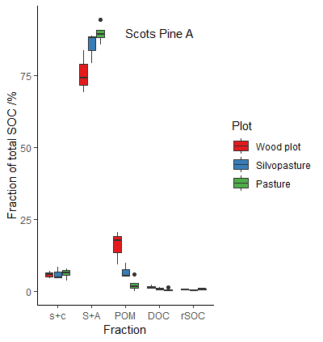
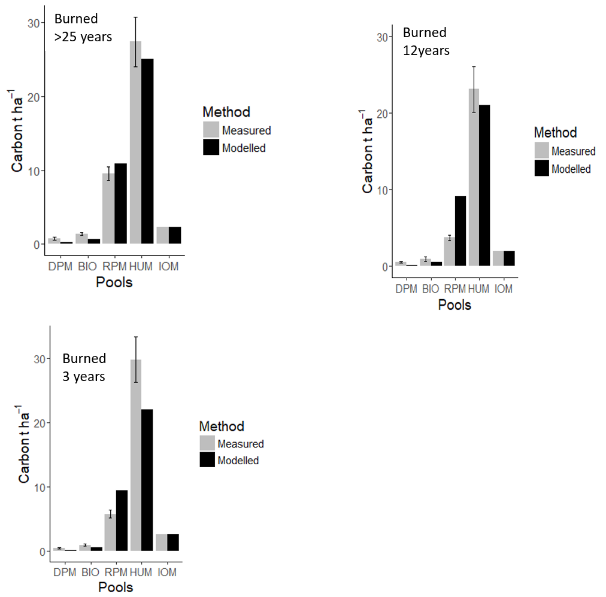
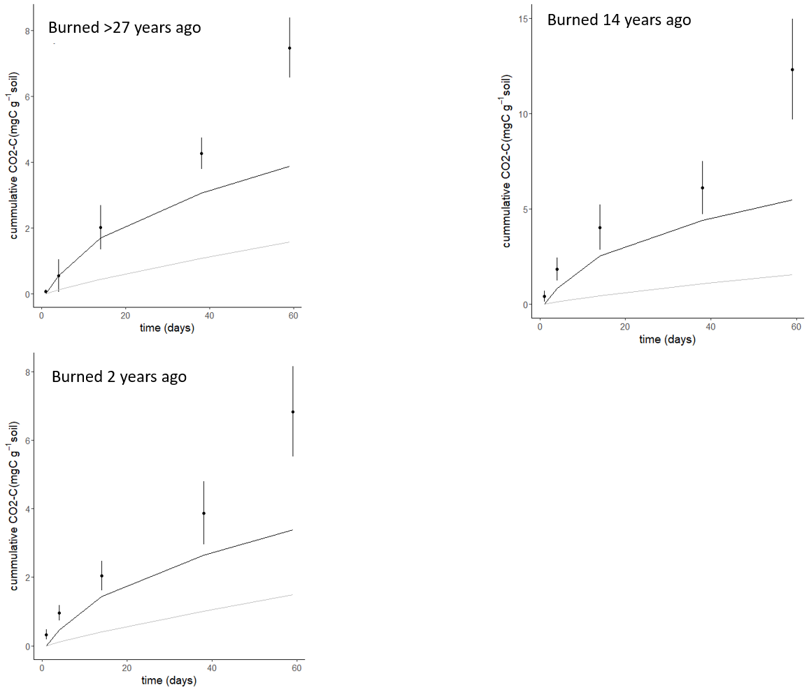
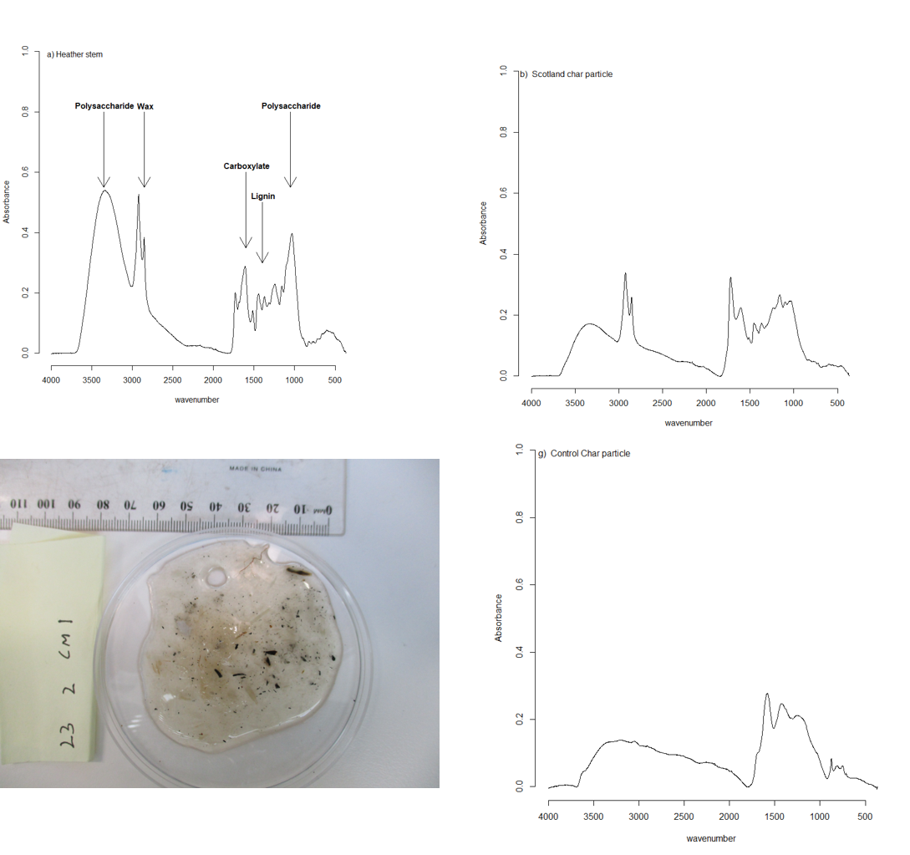

## Fractionation for model validation

--- 

## Fractionation for model validation

---

--- &slidebg bg:url('heath.png')

---

--- &twocol

## Peaty soils

*** =left
* ECOSSE
    * derived from RothC (carbon) and sundial (nitrogen)
    models
    * developed for mineral and organic soils  

*** =right

--- &twocol
## Hot water extractions and acid hydrolysis

*** =left

*** =right

--- 

## Reverse estimation of carbon pools
 

---&slidebg bg:url('fire.png')

--- 

## Spectroscopy
# for char and carbon quality assessment

