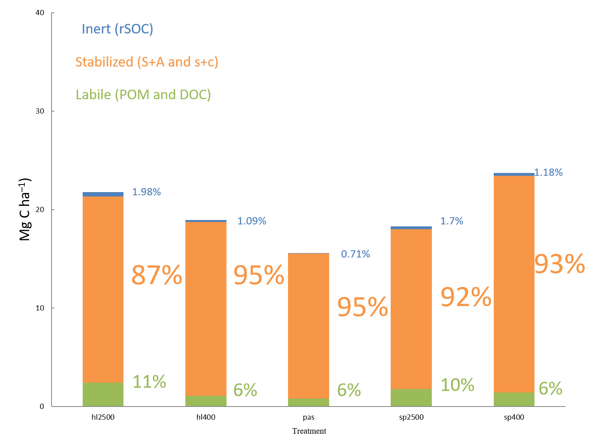
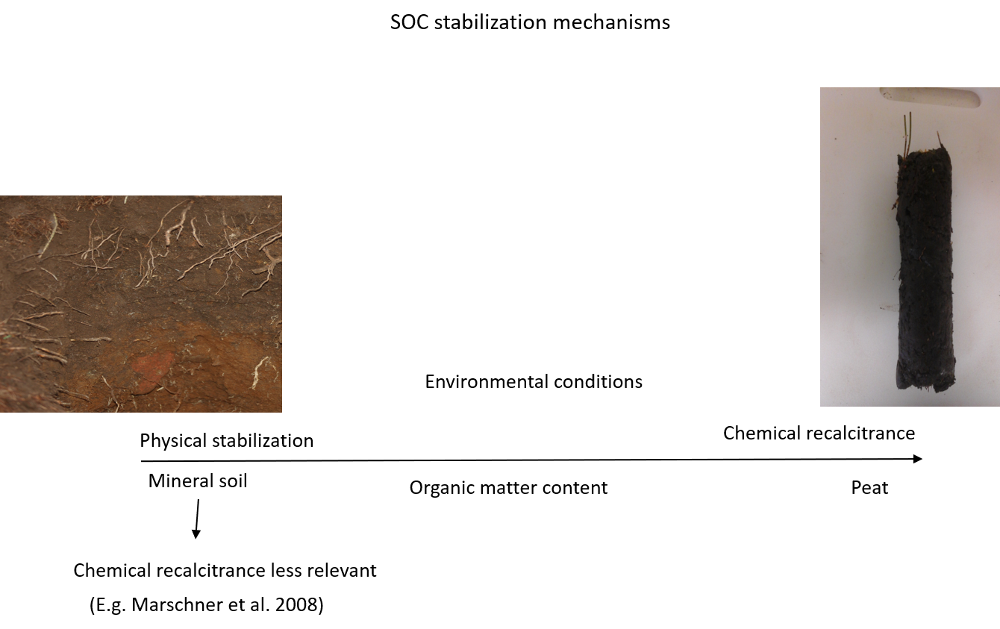

## Fractionation for model validation

---

## Fractionation for model validation
# Results

---

## Fractionation for model validation
# Results

--- &twocol

## Peaty soils

*** =left
* ECOSSE

*** =right

--- 

## Chapter 6
# Spectroscopy 

 

 

--- 

## Chapter 6
# Spectroscopy 

 

 

--- 

## Chapter 6
# Spectroscopy 

 

 

--- 

## Chapter 6

 

---

## Chapter 7
# Plate reader to measure short term respiration and priming in peat

.build 'microresp' plate reader compared to GC measurements for short term respiration

.build data collected, but still requires calibration and dry weights (underway)

.build will attempt to match to short term model

---

## Chapter 8
# Carbon sequestraion in Scottish and Tasmanian peaty soils

synthesis of previous methodology chapters, applied to the sites

Can include qualitative and quantitative FTIR

---

## Conclusion

---
