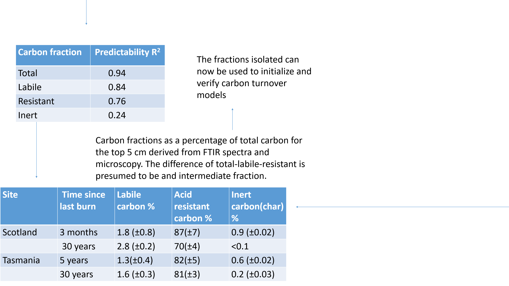

## Chapter 2
# Carbon in Tasmanian buttongrass moorland and Scottish heatland managed by burning 

.build General carbon stock chapter

.build Trying to explain differences and similarities between locations

.build Generally higher stock in Glensaugh and less difference between sites in Tas

.build potential reasons: NPP (calculated, can improve), geology

---

## Chapter 3 
# Isolation of labile carbon pools in peat using acid hydrolysis 

.build Intial results very variable, even among samples, for labile pools

.build to a lesser extent also for acid-resistant carbon

.build some match very good with model proportions, others not, no clear pattern

.build -> method testing with standardised set of samples 

.build Analysis ongoing 

---

## Chapter 4
# Chemical and optical methods to isolate charoal in peat

.build chemical methods are Sodium hypochloride and Nitric acid/hydrogen peroxide oxidation

.build -> isolate charcoal for samples with <20% C

.build -> highly organic samples too much resistant material

.build Optical method good approximation and potential to isolate and analyse char fragments

.build method subjective and trouble with some samples (too 'dark' )

 

---

## Chapter 5
# Incubation to inverse model carbon pools

.build Identidy kinetic SOM fraction (biological fractionation)

.build actual decomposition, takes microbes into account

.build can only estimate labile pools in timeframe given

.build so far values quite close to model, but requires some more parameter fitting

 

---

## Chapter 6

 

--- 

## Chapter 6
# Spectroscopy 

 

 

--- 

## Chapter 6
# Spectroscopy 

 

 

--- 

## Chapter 6
# Spectroscopy 

 

 

--- 

## Chapter 6

 

---

## Chapter 7
# Plate reader to measure short term respiration and priming in peat

.build 'microresp' plate reader compared to GC measurements for short term respiration

.build data collected, but still requires calibration and dry weights (underway)

.build will attempt to match to short term model

---

## Chapter 8
# Carbon sequestraion in Scottish and Tasmanian peaty soils

synthesis of previous methodology chapters, applied to the sites

Can include qualitative and quantitative FTIR

---

## Conclusion

---
